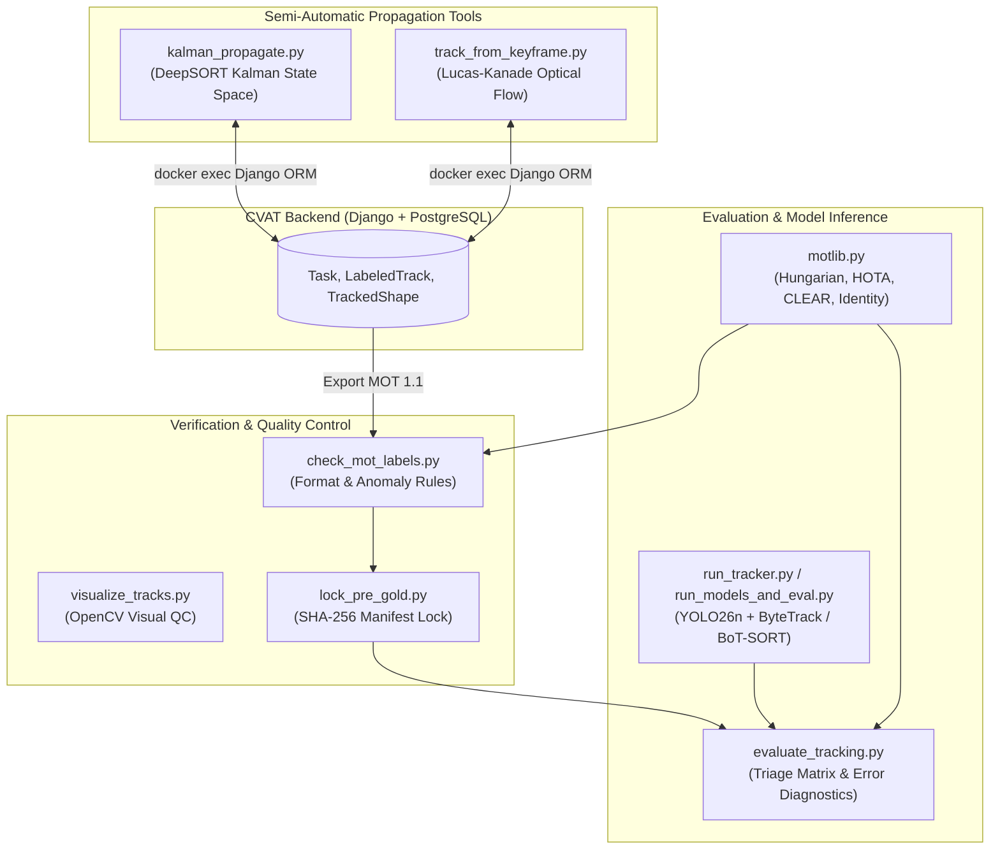
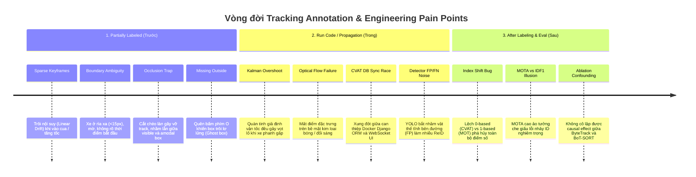

# Deep Dive: Tracking Pipeline Code Explanation & Lifecycle Pain Points

Tài liệu này phân tích chi tiết toàn bộ mã nguồn Python trong hệ thống (`tools/`), cơ chế tương tác trực tiếp với cơ sở dữ liệu CVAT backend, và mổ xẻ toàn diện các điểm nghẽn kỹ thuật (**pain points**) xuyên suốt 3 giai đoạn: **Trước khi gán nhãn / Nhãn chưa hoàn thiện (Partially Labeled)** $\rightarrow$ **Trong khi chạy mã tự động / Model Propagation (Run Code)** $\rightarrow$ **Sau khi gán nhãn / Đánh giá & Hậu xử lý (After Labeling)**.

---

## 1. Kiến trúc hệ sinh thái & Giải thích mã nguồn (Codebase Deep Dive)

Pipeline xử lý tracking của Day 3 được thiết kế module hóa thành các nhóm công cụ chuyên biệt:



---

### 1.1. `tools/kalman_propagate.py` — Lan truyền Bbox bằng Kalman Filter (DeepSORT Style)

- **Mục đích**: Tự động sinh các keyframe dự đoán tiếp theo cho các track trong CVAT từ một vài keyframe thưa do người dùng đặt, giúp giảm tải thao tác thủ công.
- **Không gian trạng thái (State Space)**:
  Sử dụng mô hình chuyển động vận tốc không đổi (Constant Velocity Model) với vector trạng thái 8 chiều:

$$\mathbf{x} = \begin{bmatrix} c_x & c_y & a & h & v_x & v_y & v_a & v_h \end{bmatrix}^\top$$

  Trong đó:
  - $c_x, c_y$: Tọa độ tâm của bounding box.
  - $a = \frac{w}{h}$: Tỷ lệ khung hình (aspect ratio).
  - $h$: Chiều cao bounding box.
  - $v_x, v_y, v_a, v_h$: Vận tốc biến thiên tương ứng theo thời gian ($\Delta t = 1\text{ frame}$).

- **Cơ chế cập nhật**:
  - Ma trận chuyển trạng thái $\mathbf{F}_{8 \times 8}$:

$$\mathbf{F} = \begin{bmatrix} \mathbf{I}_{4 \times 4} & \Delta t \cdot \mathbf{I}_{4 \times 4} \\ \mathbf{0}_{4 \times 4} & \mathbf{I}_{4 \times 4} \end{bmatrix}$$

  - Ma trận quan sát $\mathbf{H}_{4 \times 8} = \begin{bmatrix} \mathbf{I}_{4 \times 4} & \mathbf{0}_{4 \times 4} \end{bmatrix}$, đo lường trực tiếp vector $\mathbf{z} = \begin{bmatrix} c_x & c_y & a & h \end{bmatrix}^\top$.
  - Ma trận hiệp phương sai nhiễu quá trình ($\mathbf{Q}$) và nhiễu đo lường ($\mathbf{R}$) được co giãn theo kích thước thực tế của box ($h$) để thích ứng với vật thể ở xa (nhỏ) và ở gần (lớn).

- **Cầu nối CVAT backend**:
  Sử dụng `docker exec cvat_server python3 -c "..."` gọi trực tiếp Django ORM (`cvat.apps.engine.models.TrackedShape`) để chèn trực tiếp các shape mới vào database mà không cần thông qua HTTP REST API chậm chạp.

---

### 1.2. `tools/track_from_keyframe.py` — Bám vết từ 1 Keyframe qua Lucas-Kanade Optical Flow

- **Mục đích**: Tự động mở rộng một bbox đơn lẻ tại frame khởi đầu thành chuỗi chuyển động liên tục cho toàn bộ clip.
- **Thuật toán cốt lõi**:
  1. **Tạo lưới điểm đặc trưng (Dense Feature Grid)** bên trong bounding box tại keyframe gốc bằng `cv2.goodFeaturesToTrack` hoặc lưới đều (stride 5–10px).
  2. **Lucas-Kanade Bidirectional Tracking**:
     - Lan truyền điểm xuôi dòng thời gian ($t \rightarrow t+1$) và ngược dòng ($t+1 \rightarrow t$) bằng `cv2.calcOpticalFlowPyrLK`.
     - Lọc bỏ các điểm trôi dạt (drift points) có sai số Forward-Backward error vượt ngưỡng.
  3. **Ước lượng chuyển vị hình học (Geometric Transformation)**:
     - Dùng RANSAC để tìm phép biến đổi Affine / Similarity từ tập điểm còn sống sót.
     - Dịch chuyển và co giãn bounding box theo cụm điểm đồng thuận (inliers).
  4. **Phát hiện che khuất / Biến mất (Occlusion / Exit Detection)**:
     - Khi tỷ lệ điểm đặc trưng sống sót tụt xuống dưới 30% so với frame gốc, script tự động đánh dấu cờ `outside=True` và dừng lan truyền để tránh sinh ra ghost box.

---

### 1.3. `tools/motlib.py` & `tools/evaluate_tracking.py` — Động cơ Toán học & Đánh giá Tracking

- **`motlib.py`**: Thư viện toán thuần Python (không phụ thuộc scipy/sklearn) cài đặt:
  - **IoU & Bounding Box Overlap**: Tính diện tích giao chia diện tích hợp chính xác.
  - **Thuật toán Hungarian (Linear Sum Assignment)**: Giải bài toán ghép cặp nhị phân tối ưu giữa Detection và Ground Truth theo ma trận chi phí ($1 - \text{IoU}$).
  - **HOTA (Higher Order Tracking Accuracy)**: Đánh giá tích hợp trên 19 ngưỡng IoU $\alpha \in [0.05, 0.95]$:

$$\text{HOTA}_\alpha = \sqrt{\text{DetA}_\alpha \cdot \text{AssA}_\alpha}$$

    Giúp cân bằng hoàn hảo giữa độ chính xác phát hiện vật thể ($\text{DetA}$) và khả năng duy trì danh tính liên tục ($\text{AssA}$).

  - **CLEAR MOT Metrics**: Tính toán:

$$\text{MOTA} = 1 - \frac{\text{FP} + \text{FN} + \text{IDSW}}{\text{GT}}$$

    và độ chính xác định vị trung bình $\text{MOTP} = \frac{\sum_{t, i} \text{IoU}(g_i^t, d_i^t)}{\sum_t c_t}$.

  - **Identity Metrics**: Tính toán độ toàn vẹn danh tính toàn cục:

$$\text{IDF1} = \frac{2 \cdot \text{IDTP}}{2 \cdot \text{IDTP} + \text{IDFP} + \text{IDFN}}$$

- **`evaluate_tracking.py`**:
  - Không chỉ in ra con số vô hồn, script xây dựng ma trận chẩn đoán (**Triage Diagnostics**):
    - **Drift list**: Liệt kê các frame có $\text{IoU} < 0.60$.
    - **Fragmented tracks**: Chỉ ra track nào bị xé nhỏ thành nhiều ID dự đoán.
    - **Ghost boxes**: Phát hiện box của model/người gán tiếp tục tồn tại khi xe đã rời khung hình.
    - **Missed tracks**: Các track ground truth hoàn toàn bị bỏ quên.

---

### 1.4. `tools/check_mot_labels.py` & `tools/lock_pre_gold.py` — Người gác cổng Chất lượng & Khóa Tính trung thực

- **`check_mot_labels.py`**:
  - Kiểm tra tính hợp lệ của định dạng MOT 1.1: Tọa độ $x, y, w, h > 0$, frame index bắt đầu từ 1 đến $N$.
  - Bắt lỗi **Static Box Run**: Cảnh báo nếu một bbox đứng bất động trong $\ge 15$ frame liên tục (dấu hiệu quên bấm `Outside` khi xe dừng hoặc biến mất).
  - Bắt lỗi **Duplicate ID**: Cùng một ID không được phép xuất hiện 2 lần trong cùng 1 frame.
- **`lock_pre_gold.py`**:
  - Tính toán mã băm mật mã SHA-256 trên nội dung file `annotations/clip_01/gt.txt` trước khi mở reference gold.
  - Ghi lại `manifest.json` và snapshot để chứng minh học viên thực hiện quy trình Self-QC và Pre-gold độc lập, triệt tiêu gian lận "sửa nhãn theo đáp án gold".

---

## 2. Điểm nghẽn kỹ thuật (Pain Points) qua 3 giai đoạn



---

### 2.1. Giai đoạn 1: Trước khi gán nhãn / Nhãn chưa hoàn thiện (Partially Labeled)

Đây là giai đoạn annotator thực hiện thủ công hoặc đặt các keyframe ban đầu trên CVAT:

#### 🔴 Pain Point 1: Trôi nội suy tuyến tính (Linear Interpolation Drift)
- **Bản chất**: CVAT mặc định nội suy tuyến tính tọa độ $(x, y, w, h)$ giữa 2 keyframe liên tiếp.
- **Hiện tượng**: Khi xe di chuyển vào khúc cua (như Track 5, Track 6) hoặc thay đổi tốc độ đột ngột, đường đi thực tế là đường cong phi tuyến, nhưng box nội suy lại cắt theo đường thẳng dây cung.
- **Hậu quả**: Các frame ở giữa 2 keyframe bị tụt IoU nghiêm trọng ($\text{IoU} < 0.50$), tạo ra hàng loạt lỗi False Negative và giảm chỉ số $\text{MOTP}/\text{DetA}$.
- **Giải pháp**: Bổ sung keyframe tại các điểm cực trị (đỉnh cua, điểm bắt đầu phanh, đổi làn).

#### 🔴 Pain Point 2: Nhập nhằng ranh giới xuất hiện/biến mất (Entry/Exit Ambiguity)
- **Bản chất**: Xe ở khoảng cách rất xa (Track 6 ở frame 85–100) có kích thước dưới 15 pixel, lẫn vào vân mặt đường và nhiễu nén video.
- **Hiện tượng**: Annotator phân vân giữa việc gán ngay từ frame 85 (khi mắt người nhận ra vệt chuyển động) hay đợi đến frame 101 (khi hình dáng xe rõ nét).
- **Hậu quả**: Nếu gán quá sớm so với quy ước gold, hệ thống sinh ra 16 box False Positive liên tiếp; nếu gán quá muộn, sinh ra 16 box False Negative.
- **Giải pháp**: Thiết lập tiêu chuẩn định lượng trong `GUIDELINE_MINI.md`: "Chỉ bắt đầu gán khi bbox đạt tối thiểu $20 \times 20\text{ px}$ và thấy rõ tối thiểu 2 đặc điểm cấu trúc xe".

#### 🔴 Pain Point 3: Quên đánh dấu biến mất (The "Outside" Key Omission)
- **Bản chất**: Khi xe đi khuất khỏi mép ảnh hoặc bị che khuất hoàn toàn, nếu annotator chỉ dừng vẽ mà không bấm phím `O` (`Outside`), CVAT sẽ giữ nguyên vị trí bbox tĩnh ở frame cuối cho đến hết video.
- **Hậu quả**: Tạo ra các "Ghost Box" đứng im ven đường, gây bùng nổ số lượng False Positive (`check_mot_labels.py` cảnh báo lỗi Static Run).

---

### 2.2. Giai đoạn 2: Trong khi chạy mã tự động / Model-Assisted Propagation (Run Code)

Giai đoạn sử dụng các script hỗ trợ (`kalman_propagate.py`, `track_from_keyframe.py`) hoặc chạy inference model tracker:

#### 🔴 Pain Point 4: Lệch quán tính trong Kalman Filter (Kalman Filter Overshoot)
- **Bản chất**: `kalman_propagate.py` giả định mô hình vận tốc không đổi (Constant Velocity).
- **Hiện tượng**: Khi xe phanh dừng chờ đèn đỏ hoặc giảm tốc đột ngột, Kalman filter vẫn giữ nguyên vector vận tốc $[v_x, v_y]$ cũ và tiếp tục "phóng" bbox về phía trước thêm 5–10 frame trước khi dừng.
- **Hậu quả**: Bbox tự động sinh bị vọt lố ra khỏi thân xe thực tế, đòi hỏi người gán phải tốn thời gian kéo chỉnh lại từng frame.

#### 🔴 Pain Point 5: Trôi dạt điểm quang thông (Optical Flow Texture Loss & Drift)
- **Bản chất**: Lucas-Kanade (`track_from_keyframe.py`) phụ thuộc vào giả định độ sáng không đổi (Brightness Constancy) và kết cấu cục bộ phong phú (Rich Texture).
- **Hiện tượng**: Nóc và kính xe ô tô là các mặt phẳng kim loại/kính đồng màu, bóng loáng, phản chiếu ánh sáng môi trường liên tục khi xe di chuyển.
- **Hậu quả**: Điểm đặc trưng bị trượt trên bề mặt trơn nhẵn, khiến bbox bị co rút (shrink) hoặc biến dạng méo mó sau 10–15 frame lan truyền.

#### 🔴 Pain Point 6: Xung đột đồng bộ cơ sở dữ liệu CVAT (DB Race Condition via Docker Exec)
- **Bản chất**: Các script Python can thiệp trực tiếp vào PostgreSQL qua Django ORM bên trong container `cvat_server`.
- **Hiện tượng**: Nếu annotator vẫn đang mở tab trình duyệt CVAT và thực hiện chỉnh sửa, client frontend giữ cache state trong WebSocket/Redux store. Khi người dùng bấm `Ctrl+S` trên giao diện, frontend sẽ ghi đè toàn bộ dữ liệu cũ lên trên các shape mà script Python vừa tạo ra.
- **Hậu quả**: Mất sạch dữ liệu vừa sinh tự động.
- **Quy tắc an toàn**: Luôn `Save` $\rightarrow$ Đóng hoặc tải lại trang web CVAT $\rightarrow$ Chạy script Python $\rightarrow$ Mở lại giao diện web để kiểm tra.

#### 🔴 Pain Point 7: Nhiễu từ Detector nền (YOLO26n FP/FN Pollution)
- **Bản chất**: Bộ theo dõi ReID / ByteTrack không thể tự vẽ ra bounding box nếu detector không tìm thấy đối tượng.
- **Hiện tượng**: YOLO26n phát hiện nhầm các cấu trúc cố định ven đường (như ID 7 từ frame 16–116) hoặc bỏ sót các xe bị che khuất một phần (FN).
- **Hậu quả**: Khi chạy đánh giá model vs human, các lỗi này thường bị hiểu nhầm là lỗi của thuật toán tracking, trong khi bản chất gốc rễ 100% thuộc về giới hạn nhận diện của object detector.

---

### 2.3. Giai đoạn 3: Sau khi gán nhãn / Đánh giá & Hậu xử lý (After Labeling & QC)

Giai đoạn xuất file MOT 1.1, tự kiểm, chạy benchmark và viết báo cáo:

#### 🔴 Pain Point 8: Cạm bẫy lệch chỉ số Frame (0-based vs 1-based Index Shift)
- **Bản chất**: Giao diện người dùng của CVAT hiển thị frame bắt đầu từ $0$, trong khi quy chuẩn học thuật MOTChallenge / MOT 1.1 quy định frame đầu tiên là $1$.
- **Hậu quả**: Nếu export sai cấu hình làm toàn bộ file nhãn bắt đầu từ 0, khi đưa vào chấm điểm với file gold (đánh số từ 1), tất cả các frame sẽ bị lệch pha 1 bước thời gian $\rightarrow$ IoU giữa detection và gold tại mọi thời điểm tụt về $0$, kéo toàn bộ HOTA, MOTA, IDF1 về $0.000$.
- **Công cụ giải cứu**: `check_mot_labels.py` có cơ chế tự động nhận diện mảng frame $0..N-1$ và cung cấp ngay lệnh fix:
  ```bash
  awk -F, 'BEGIN{OFS=","}{$1=$1+1; print}' annotations/clip_01/gt.txt > /tmp/fixed.txt && mv /tmp/fixed.txt annotations/clip_01/gt.txt
  ```

#### 🔴 Pain Point 9: Ảo tưởng điểm số giữa MOTA và IDF1 (Metric Discrepancy)
- **Bản chất**:
  - MOTA tính phạt lỗi tại từng frame độc lập: mỗi lần đổi ID chỉ bị phạt 1 điểm IDSW trên tổng số hàng nghìn detection.
  - IDF1 đo lường sự trùng khớp của cả chuỗi danh tính từ đầu đến cuối clip.
- **Hiện tượng**: Một annotator/tracker có thể đạt $\text{MOTA} = 0.85$ (rất cao) nhưng $\text{IDF1}$ chỉ đạt $0.40$ (cực thấp).
- **Nguyên nhân**: Bbox vẽ rất khít từng frame (ít FP/FN), nhưng track bị nhảy ID liên tục sau mỗi pha che khuất. Nếu chỉ nhìn vào MOTA, kỹ sư sẽ đưa ra kết luận hoàn toàn sai lệch về chất lượng hệ thống.

#### 🔴 Pain Point 10: Gian lận vô thức (Data Leakage & Gold Overfitting)
- **Bản chất**: Xu hướng tâm lý muốn sửa lại nhãn của mình sau khi xem file đáp án gold hoặc output của model.
- **Hậu quả**: Phá hủy tính khách quan của dữ liệu kiểm thử độc lập, biến benchmark thành phép so khớp vô nghĩa.
- **Giải pháp**: Cơ chế bắt buộc chạy `tools/lock_pre_gold.py` để tạo hash SHA-256 niêm phong nhãn độc lập trước khi mở bất kỳ tài liệu tham chiếu nào.

---

## 3. Bảng tổng kết Ma trận Khắc phục Sự cố (Troubleshooting Matrix)

| Giai đoạn | Triệu chứng / Lỗi | Nguyên nhân cốt lõi | Cách xử lý dứt điểm |
| :--- | :--- | :--- | :--- |
| **Trước (Partially)** | Cảnh báo *Static run $\ge 15$ frames* | Quên bấm `Outside` (phím `O`) khi xe biến mất | Tua đến frame xe vừa khuất, chọn track và bấm `O` |
| **Trước (Partially)** | Bbox bị lệch khỏi xe ở giữa 2 keyframe | Trôi nội suy do xe cua / đổi tốc độ phi tuyến | Chèn thêm 1–2 keyframe tinh chỉnh ở giữa khúc cua |
| **Trong (Run Code)** | Script Python không chèn được shape vào CVAT | Xung đột cache UI hoặc sai `task_id` | Đóng task trên UI, chạy lại script với đúng `--task-id` |
| **Trong (Run Code)** | Kalman box phóng vọt qua thân xe | Xe phanh gấp, quán tính Kalman không cập nhật | Giảm `--predict-frames` hoặc bổ sung keyframe đo lường |
| **Sau (After)** | Tất cả metric = 0.000 khi chạy `evaluate_tracking.py` | Lệch chỉ số frame (0-based thay vì 1-based) | Dùng `awk` tăng toàn bộ giá trị cột 1 lên $+1$ |
| **Sau (After)** | MOTA cao nhưng IDF1 thấp | Track bị vỡ vụn hoặc nhảy ID sau va chạm | Rà soát các pha giao cắt, gộp các đoạn rời rạc về cùng 1 `track_id` |
| **Sau (After)** | ReID sinh ra nhiều False Positive | YOLO detector bắt nhầm vật thể tĩnh bên đường | Lọc bỏ track tĩnh có chuyển vị $\Delta(x, y) \approx 0$ trên nhiều frame |

---

## 4. Kết luận

Tracking không đơn thuần là việc vẽ các hình chữ nhật đơn lẻ, mà là bài toán **quản lý tính liên tục của danh tính trong không gian - thời gian**. Việc nắm vững cơ chế toán học của Kalman filter, Optical Flow, ma trận đối sánh Hungarian và hiểu rõ sự khác biệt giữa các hệ số đo lường (HOTA vs MOTA vs IDF1) là chìa khóa then chốt để xây dựng pipeline gán nhãn và huấn luyện mô hình thị giác máy tính đạt chuẩn công nghiệp.
